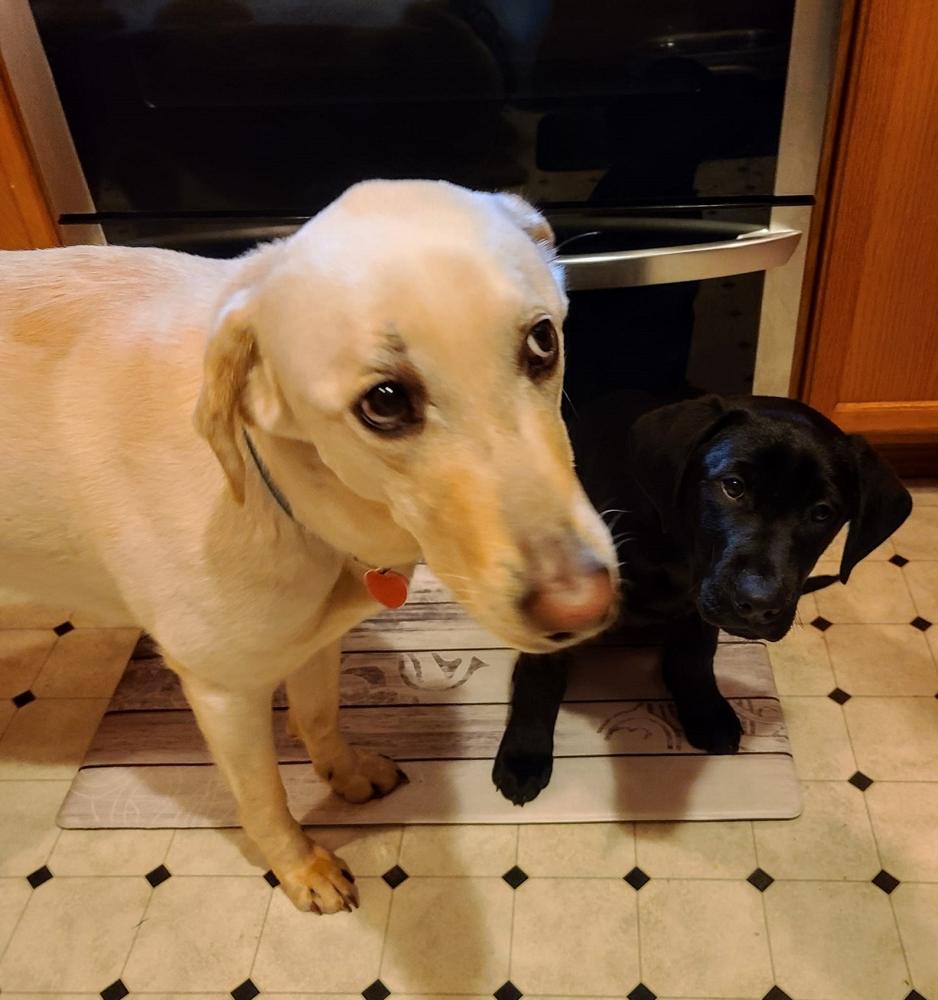

# Mike McCarty

I'm Mike McCarty, a future software developer who is currently drinking from the coding **firehose**!

## Who Is Mike McCarty?

A Navy veteran who spent almost 12 years serving on 2 different submarines, first as a *Nuclear* systems mechanic, then as a *Nuclear* systems supervisor. Constantly being at sea was not the long term career choice I wanted and found my second career in Information Technology (IT). Started out where many others start in IT at the Help Desk and help many titles some of which included systems administrator, network engineer, & crypto device SME (subject matter expert.) My favorite position was as an instructor at [Year Up](https://www.yearup.org/locations/wa-seattle-scc-campus) in Seattle, WA. Helping young adults learn about IT and gaining entry into a Helpdesk or Desktop Support position was very rewarding.  It has been by far my favorite job due to the work and more importantly the people I worked with and the students I served.

## Where am I?

I live near Elma, WA, a town west of Olympia and about a 20 minute drive.  My life is with my amazing wife Jennifer and our two dogs, Blondie and Laszlo.  Blondie is a four year old half-lab/half-whippet and Laszlo is a year old black lab.  Below are the two of them in more calmer times when Laszlo was just 2 months old before he got a lot *bigger*.

## GitGub Portfolio

[Mike's GitHub Portfolio Page](https://github.com/mikemac1)

## 102 Table of Contents

- [Reading Assignment 01](first-markdown.md)
- [Reading Assignment 02](coders-computer.md)
- [Lab Assignment 01b](learning-markdown.md)
- [Reading Assignment 03](git.md)
- [Reading Assignment 04](wireframe.md)
- [Reading Assignment 05](css.md)
- [Reading Assignment 06](javascript.md)
