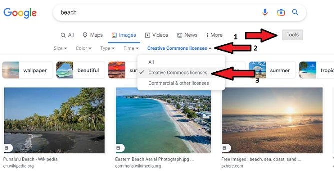

# Read 01

## Why This Matters

## Questions To Answer

### An Acrostic HTML & Parsing Poem

**C**alling for a web page requires two parties

**O**ne is the client

**D**uring the time a request is being sent by the client a server awaits

**E**ach has their distinct role

**F**ollowing the request a response is served
**E**ach HTML response is parsed by the client's browser
**L**onely, the parser encounters a reference to a script file
**L**oopy, the parser stops parsing & requests the script file.
**O**rdering the script from the server, the parser executes.
**W**hile the client's browser finishes reading the HTML
**S**ampling the full response, a web page is born

    Written by Mike McCarty

### Describe How HTML, CSS, and JS files Are “Parsed”

Parsing is a very critical step from having a webpage on a server to seeing the page on the user's screen. A client's browser must have the HTML data and links to external CSS & JS files. The intial step for parsing is building the page based on the DOM (Document Object Model) & utilizing tokens. The tokens can assign specific pieces that represent pieces of the DOM and to be requested from the server. It is important for developers to understand this process as it greatly impacts latency & how the client's machine is single threaded. Bottom line a user wants their page quickly and design of a webpage can impact how a browser parses the HTML, CSS, & JS data.

### How To find Images To Add To A Website

The issue is never about finding an image that looks good. The issue for me as a developer is to ensure that an image is not copyrighted. The easiest way is to utilize Google's image search feature and in options use the "Creative Commons licenses" selection to ensure the image is available for usage.

### "String" vs A Number

Visualizing a string versus a number in javascript is all about ' ' or " ". For example:

    - 24
    - "24"
The first 24 is the number, while "24" is the string.

### What is a Variable and why are they important in JS

A variable can be considered a proxy, to a permanent or temporary place that holds some value whether it be a string, number or an object. Having a variable makes JS powerful for a couple of reasons. One it gives the programmer an easy way to store a value by giving it a name that makes sense to those who are reading the code. Second, the fact that variables can temporarily store a value gives JS the ability to have a variable a part of a function that asks a user a question or has a graphic move on a website.

### What is an HTML Attribute

An attribute provides an option(s) to add to additional functionality to an HTML element. One example of that functionality is to add a class or id to an HTML element to provide CSS style properties to the element on a page. Another example can be to provide dimensions to a picture in the 'img' element overriding the inherent dimensions the picture already has.

### Describe the Anatomy of an HTMl element

THe construction of an HTML element is to surround content with elements to provide structure for the browser to display. It starts with an opening tag, whether it identifies as a type of heading, place on the page like a header or footer, or maybe it is a paragraph.  Each opening tag may contain some attribute, then the content is listed, and followed by the closing element's tag.  In some instances the opening tag may be self-closing. For example 'img' or 'br'.

**REFERENCE**: [MDN Web Docs](https://developer.mozilla.org/en-US/docs/Learn/Getting_started_with_the_web/HTML_basics)

### What is the Difference between 'article' and 'section' element tags

The HTML article element can be utilized for a specific block of content such as a forum or blog post. The article is going to seperate the content on the page.
Coders will usually use the section element to divide long documents into chapters, or create different tabs, or divide various themes on the page.

### What Elements does a “typical” website include

HTML utilizes some common tags for typical areas in a website. They are:

- header: 'header'
- navigation bar: 'nav'
- main content: 'main' with various content subsections including:
  - 'article', 'section', and 'div' elements
- sidebar: 'aside'
- footer: 'footer'

### How does metadata influence Search Engine Optimization

### How is the 'meta' HTML tag used when specifying metadata

### What is the first step to designing a Website

### What is the most important question to answer when designing a Website

### Why should you use an 'h1' element over a 'span' element to display a top level heading

### What are the benefits of using semantic tags in our HTML

### Describe 2 things that require JavaScript in the Browser

### How can you add JavaScript to an HTML document

## Summarize This Topic

## Things I want to know more about

## Sources Utilized

[Article vs Section Elements](https://www.positioniseverything.net/html-article-vs-section)

[Getting Started With HTML](https://developer.mozilla.org/en-US/docs/Learn/HTML/Introduction_to_HTML/Getting_started)

[Document and website structure](https://developer.mozilla.org/en-US/docs/Learn/HTML/Introduction_to_HTML/Document_and_website_structure)
