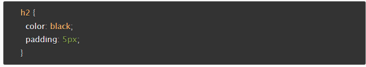

# Reading Assignment 02

## Why This Matters

Structure makes a significant different in coding, no matter if it is HTML, CSS, or JS. Utilizing the proper semantic elements in HTML, external CSS file, or having the correct conditional in JS means it gives future developers who review the code an understanding of what is being written and allows for scaling without additional interpretation.

## Questions To Answer

### Why Is It Important To Use Semantic Elements In Our HTML

Semantics provides definition for elements in the HTML document.  Being able to identify a heading versus a subheading with the use of an element such as `h1` or `h2` gives an identifiable separation between the two for both the browser and the user. An example of that benefit is one of accessibility. Visually impaired users can get a great idea of what is on the page and the material most important due to heading elements.

### How Many Levels Of Headings Are There In HTML

There are 6 levels of headings.

### What Are Some Uses For The `sup` And `sub` Elements

Superscript(`sup`) & subscript(`sub`) can be used for math equations (i.e. fractions or exponents), dates (i.e. 3rd), and trademark symbols.

### When Using The `abbr` Element, What Attribute Must Be Added To Provide The Full Expansion Of The Term

The "title" attribute must be used to provide a full expansion of the term.

### What Are Ways We Can Apply CSS To Our HTML

There are three options to add CSS:

- **Internal**: is the usage of a `style` tag within the head element that contains all of the css code for the page.
- **External**: found in a single file which several webpages can reference. This provides code reusability and adds speed to maintaining.
- **Inline**: this is not recommended but the code is written inside a specific HTML element at a specific location on an HTML document. The reason it is not recommended is it makes it very difficult for developers to maintain as the project scale increases.

### Why Should We Avoid Using Inline Styles

The reason it is not recommended is it makes it very difficult for developers to maintain as the project scale increases.

### Review The Block Of Code Below And Answer The Following Questions

1. **What is representing the selector?**
h2

2. **Which components are the CSS declarations?**
The property paired with the value is the declaration. There are 2 declarations below, color with black is one and padding with 5px is the other.

3. **Which components are considered properties?**
Color and padding are the two properties.

### What Data Type Is A Sequence Of Text Enclosed In Single Quote Marks

String.

### List 4 Types Of JavaScript Operators

- Addition (+)
- Subtraction (-)
- Division (/)
- Multiplication (*)

### Describe A Real World Problem You Could Solve With A Function

The immediate problem that comes to mind would be converting between metric & imperial units or vice versa. For instance in my vehicle is an analog speedometer that has miles per hour on the outer ring and on the inner ring is kilometers per hour. To have a digital readout showing miles per hour with the option to switch to kilometers per hour could be use of the function.

### An `if` Statement Checks A __ And If It Evaluates To ___, Then The Code Block Will Execute

An `if` statement checks a  **condition** and if it evaluates to **true**,  then the code block will execute.

### What Is The Use Of An `else if`

The `else if` allows for additional comparisons beyond an `if...else`. This allows a coder to add together extra choices.

### List 3 Different Types Of Comparison Operators

<, >, >=

### What Is The Difference Between The Logical Operator `&&` And `||`

`&&` provides two or more expressions to all evaluate to true for the whole expression to return true, while with `||` only requires one expression to evaluate to true for the whole expression to return true.

## Things I Want To Know More About

## Sources Utilized

[Introduction to HTML](https://developer.mozilla.org/en-US/docs/Learn/HTML/Introduction_to_HTML)

[HTML text fundamentals](https://developer.mozilla.org/en-US/docs/Learn/HTML/Introduction_to_HTML/HTML_text_fundamentals)

[Advanced text formatting](https://developer.mozilla.org/en-US/docs/Learn/HTML/Introduction_to_HTML/Advanced_text_formatting)

[How CSS is structured](https://developer.mozilla.org/en-US/docs/Learn/CSS/First_steps/How_CSS_is_structured)

[JavaScript basics](https://developer.mozilla.org/en-US/docs/Learn/Getting_started_with_the_web/JavaScript_basics)

[HTML Headings](https://www.w3schools.com/html/html_headings.asp)

[Making decisions in your code — conditionals](https://developer.mozilla.org/en-US/docs/Learn/JavaScript/Building_blocks/conditionals)
