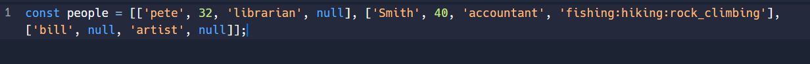
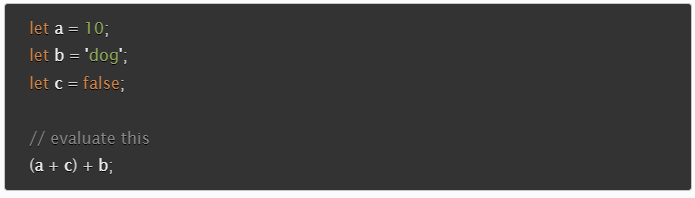

# Reading Assignment 03

## Why This Matters

## Questions To Answer

### When Should You Use An `Unordered List` In Your HTML Document

An unordered list is utilized when the order of the item is meaningless.

### How Do You Change The Bullet Style Of Unordered List Items

The bullet style can be change with the use of the `type` attribute. The values it supports are circle, disc, and square. Some browsers will also support triangle for the value.

### When Should You Use An Ordered List vs An Unorder List In Your HTML Document

Using an ordered list means the order is meaningful like using steps for making a meal or directions from one location to another. An unordered list does not require the items to be in order and no item has one priority over another.

### Describe Two Ways You Can Change The Numbers On List Items Provided By An Ordered List

A developer can use the the following ways to change the numbers on `li`:

- `type="I"`: the list items are numbered with upper case roman numbers.
- `type="i"`: the list items are numbered with lower case roman numbers.
- `type="A"`: the list items are numbered with upper case letters.
- `start="4"`: instead of starting with 1 will start with the number 4.

### Describe The CSS Properties Of `margin` And `padding` As Characters In A Story. What Is Their Role In A Story Titled: “The Box Model”

**The Box Model** by *Mike McCarty*

`margin` and `padding` were buddies. They loved the same things and were always excited about seeing `content`, the coolest dude on the page.  However there is a bully in the neighborhood and his name is `border`. Whenever `margin` or `padding` approach each other, `border` was always getting bigger with his pixels creating separation between the two.  Until one day, a superhero named developer came walking by and placed a none in the `border`. `margin` and `padding` were forever grateful and placed their `background-color` to #ff1a1a so everyone can see their excitement. The end!

### List And Describe The Four Parts Of An HTML Elements Box As Referred To By The Box Model

- Content box: area displaying the text or images that exist on the page.
- Padding box: is the white space that immediately surrounds the content.
- Border box: wraps the padding and separates it from the margins.
- Margin box: is the outer area around the border.

### What Data Types Can You Store Inside Of An Array

String, number, arrays, and objects.

### Is The `People` Array A Valid JavaScript Array? If So, How Can I Access The Values Stored? If Not, Why?

Yes the `people` array is an array with three nested arrays. Yes the values can be accessed utilizing the values index. For instance if I wanted to access the value `accountant`. I would do so by using `people[1][2]`. This indicates the first number 1 shows `accountant` resides in the 2nd array indexed by 1 as arrays start counting at 0 and is in the 3rd listed place which is indexed by the number 2.

### List Five Shorthand Operators For Assignment In JavaScript And Describe What They Do

`X += 1`: is saying x = x + 1 so the variable is incrementing by adding 1 to itself.

`x -= 1`: is saying x = x - 1 so the variable is decrementing by subtracting 1 to itself.

`X *= 2`: is saying x = x x 2 so the variable is increasing by multiplying 2 to itself.

`X /= 2`: is saying x = x / 2 so the variable is decreasing by dividing 2 to itself.

`X **= 2`: is saying x = x ^ 2 so the variable is increasing by taking the exponent of 2 to itself.

### Read The Code Below And Evaluate The Last Expression And Explain What The Result Would Be And Why

From my console log the answer returned is 10dog. The reason I can think of is the browser concatenates the number and string values together and ignores the false boolean value.

### Describe A Real World Example Of When A Conditional Statement Should Be Used In A JavaScript Program

The immediate example that comes to mind is an electronic thermostat for an air conditioner. When the temperature reaches a setpoint, say 80 degrees, the air conditioner turns on. When temperature falls below the setpoint, maybe the same temperature or say 77 degress, the air conditioner turns off.

### Give An Example Of When A Loop Is Useful In JavaScript

When there is a finite number of attempts at some function is required a loop is best used. For example lets say a user is entering their password. If you want to ensure it is not a hacker you can give them five tries before the account is locked out and will require an administrator to unlock it.

## Things I Want To Know More About

## Sources Utilized

[`ol`: The Ordered List element](https://developer.mozilla.org/en-US/docs/Web/HTML/Element/ol)

[`ul`: The Unordered List element](https://developer.mozilla.org/en-US/docs/Web/HTML/Element/ul)

[HTML Ordered List | HTML Numbered List](https://www.javatpoint.com/html-ordered-list)

[The box model](https://developer.mozilla.org/en-US/docs/Learn/CSS/Building_blocks/The_box_model)

[Arrays](https://developer.mozilla.org/en-US/docs/Learn/JavaScript/First_steps/Arrays)

[Expressions and operators](https://developer.mozilla.org/en-US/docs/Web/JavaScript/Guide/Expressions_and_Operators)

[Making decisions in your code — conditionals](https://developer.mozilla.org/en-US/docs/Learn/JavaScript/Building_blocks/conditionals)

[Looping code](https://developer.mozilla.org/en-US/docs/Learn/JavaScript/Building_blocks/Looping_code)
