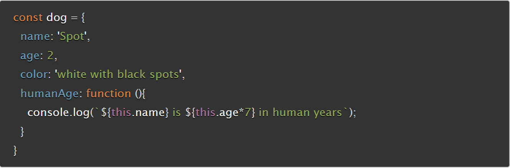

# Reading Assignment 06

## Why This Matters

## Questions To Answer

### How would you describe an object to a non-technical friend you grew up with?

### What are some advantages to creating object literals?

### How do objects differ from arrays?

### Give an example for when you would need to use bracket notation to access an object’s property instead of dot notation.

### Evaluate the code below. What does the term `this` refer to and what is the advantage to using `this`?

;

### What is the DOM?

### Briefly describe the relationship between the DOM and JavaScript

## Sources Utilized

[JavaScript object basics](https://developer.mozilla.org/en-US/docs/Learn/JavaScript/Objects/Basics)
[Introduction to the DOM](https://developer.mozilla.org/en-US/docs/Web/API/Document_Object_Model/Introduction)
